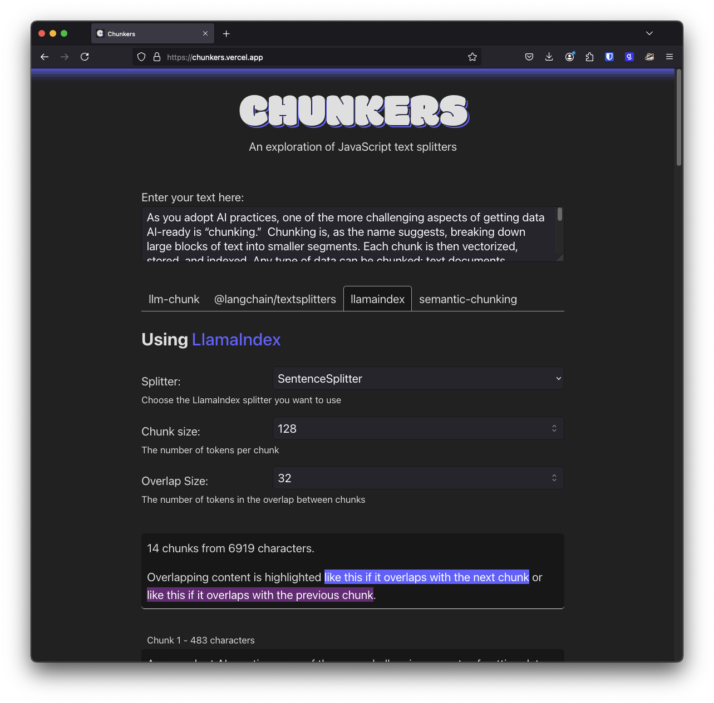

[Retrieval-augmented generation (RAG)](https://www.ibm.com/think/topics/retrieval-augmented-generation) applications begin with data, so getting your data in the right shape to work well with [vector databases](https://www.ibm.com/think/topics/vector-database) and [large language models (LLMs)](https://www.ibm.com/think/topics/large-language-models) is the first challenge you’re likely to face when you get started building. In this post, we'll discuss the different ways to work with text data in JavaScript, exploring how to split it up into chunks and prepare it for use in a RAG app.

<div class="info">
  <p>This post was originally written for DataStax, but didn't survive a content migration as part of <a href="https://www.ibm.com/new/announcements/ibm-to-acquire-datastax-helping-clients-bring-the-power-of-unstructured-data-to-enterprise-ai-applications">IBM's purchase</a>. I thought the content was useful, so have republished it here.</p>
</div>

## Why chunking is important

Often you will have swaths of unstructured text content that need to be broken down into smaller chunks of data. These chunks of text are turned into vector embeddings and stored in a vector database like [Astra DB](https://docs.datastax.com/en/astra-db-serverless/index.html).

Compared to a whole document, smaller chunks of text capture fewer topics or ideas, which means that their embeddings will contain more focused meaning. This makes each chunk easier to match against incoming user queries and makes for more accurate retrieval. When you improve your retrieval, you can feed fewer, but more relevant, tokens to an LLM and create a more accurate and useful RAG system.

If you want to read more on the theory behind text chunking check out this post from Unstructured on [best practices for chunking](https://unstructured.io/blog/chunking-for-rag-best-practices).

## Chunking in JavaScript

Let's move beyond theory and take a look at the options in JavaScript to chunk your data. The libraries we're going to look at are: [llm-chunk](https://github.com/golbin/llm-chunk), [LangChain](https://js.langchain.com/v0.1/docs/modules/data_connection/document_transformers/), [LlamaIndex](https://ts.llamaindex.ai/modules/node_parser), and [semantic-chunking](https://github.com/jparkerweb/semantic-chunking). You can [experiment with these chunking libraries using this app](https://chunkers.vercel.app/) I put together.



We'll also take a look at using the [Unstructured API](https://docs.unstructured.io/api-reference/api-services/overview) for more complex use cases. Let's get started with the simplest of these modules.

## llm-chunk

[llm-chunk](https://github.com/golbin/llm-chunk) describes itself as a "super simple and easy-to-use text splitter" and it is! You can install it using npm with:

```shell
npm install llm-chunk
```

It consists of one function, `chunk`, and it takes just a few options. You can choose maximum and minimum sizes for the chunks it produces, pick the size of the overlap between chunks, and choose a strategy for splitting the text, either by sentence or paragraph.

By default, it will split text up by paragraphs with a maximum length of 1,000 characters, and no minimum length or overlap.

```js
import { chunk } from "llm-chunk";
const text = loadText(); // get some text to split
const chunks = chunk(text);
```

You can choose to split the text by sentences, alter the maximum and minimum number of characters by chunk, or by how many characters each chunk should overlap.

```js
const chunks = chunk(text, { minLength: 128, maxLength: 1024, overlap: 128 });
```

For more complex use cases, you can opt to parse a set of delimiters. These get turned into a regular expression and used as the basis for splitting up the text instead of just by paragraph or sentence. llm-chunk is simple, fast, and a great option when you are starting your RAG journey.

## LangChain

[LangChain](https://js.langchain.com/) is much more than a text splitter. It is a library that helps you load data, split it up, embed it, store that data in and retrieve it from vector databases, feed it as a prompt to LLMs, and more. There’s a lot to explore with [LangChain](https://js.langchain.com/), but we’re going to concentrate on text splitting.

You can install the LangChain text splitters with this command:

```shell
npm install @langchain/textsplitters
```

If you are using the main [langchain module](https://www.npmjs.com/package/langchain) then `@langchain/textsplitters` is included as a dependency.

LangChain includes three main splitter classes, the `CharacterTextSplitter`, `RecursiveCharacterTextSplitter`, and `TokenTextSplitter`. Let's take a look at what each of them do.

### `CharacterTextSplitter`

This is the simplest of the splitters provided by LangChain. It splits up a document by a character, then merges segments back together until they reach the desired chunk size, overlapping the chunks by the desired number of characters.

The default character for splitting up text is "\n\n". This means it aims to initially split the text by paragraphs, though you can also provide the character you want to split by too. Here's how you would use this LangChain splitter:

```js
import { CharacterTextSplitter } from "@langchain/textsplitters";
const text = loadText(); // get some text to split
const splitter = new CharacterTextSplitter({
  chunkSize: 1024,
  chunkOverlap: 128,
});
const output = await splitter.splitText(text);
```

You can also output [LangChain Documents](https://js.langchain.com/v0.2/docs/concepts/#document) which is useful if you are using the rest of LangChain to create a data pipeline:

```js
const output = await splitter.createDocuments([text]);
```

### `RecursiveCharacterTextSplitter`

The `CharacterTextSplitter` is naive, and doesn't take into account much of the structure of a piece of text. The `RecursiveCharacterTextSplitter` goes beyond by using a list of separators to progressively break text down until it creates chunks that fit the size you want. By default it splits text first by paragraphs, then sentences, then words.

```js
import { RecursiveCharacterTextSplitter } from "@langchain/textsplitters";
const text = loadText(); // get some text to split
const splitter = new RecursiveCharacterTextSplitter({
  chunkSize: 1024,
  chunkOverlap: 128,
});
const output = splitter.splitText(text);
```

You can provide different characters for the `RecursiveCharacterTextSplitter` to split the text on so it can be used to split up other types of text. There are two classes available that make it easy to split up Markdown or Latex, the `MarkdownTextSplitter` and `LatexTextSplitter` respectively.

But this can also be used to [split up code](https://js.langchain.com/v0.1/docs/modules/data_connection/document_transformers/code_splitter/) for a number of different languages. For example, if you wanted to split up a JavaScript file, you could do this:

```js
const splitter = RecursiveCharacterTextSplitter.fromLanguage("js", {
  chunkSize: 300,
  chunkOverlap: 0,
});
const jsOutput = await splitter.splitText(jsCode);
```

The `RecursiveCharacterTextSplitter` is a versatile text splitter and is likely a good first stop when you're building up a pipeline to ingest data for your RAG application.

### TokenTextSplitter

Taking a different approach, the `TokenTextSplitter` turns the text first into [tokens](https://help.openai.com/en/articles/4936856-what-are-tokens-and-how-to-count-them) using [js-tiktoken](https://github.com/dqbd/tiktoken), splits the tokens into chunks and then converts the tokens back into text.

Tokens are the way that LLMs consume content, a token can be a whole word or just a part of it. [OpenAI has a good representation of how their models break text into tokens](https://platform.openai.com/tokenizer). You can use the `TokenTextSplitter` like this:

```js
import { TokenTextSplitter } from "@langchain/textsplitters";
const text = loadText(); // get some text to split
const splitter = new TokenTextSplitter({
  chunkSize: 1024,
  chunkOverlap: 128,
});
const output = splitter.splitText(text);
```

## LlamaIndex

[LlamaIndex](https://ts.llamaindex.ai/) is also responsible for much more than just text splitting. We're going to hone in on the splitting capabilities though, which you can use outside of LlamaIndex too.

LlamaIndex considers chunks of a document as Nodes and the rest of the library works with Nodes. There are three available processors: `SentenceSplitter`, `MarkdownNodeParser`. and `SentenceWindowNodeParser`.

You can install the entire LlamaIndex suite with:

```shell
npm install llamaindex
```

If you just want the text parsers, you can install just the LlamaIndex core:

```shell
npm install @llamaindex/core
```

### `SentenceSplitter`

The `SentenceSplitter` is the simplest of the LlamaIndex splitters. It splits the text into sentences and then combines them into a string that is smaller than the provided `chunkSize`.

LlamaIndex does this differently from the previous splitters; it measures the size of a chunk in tokens rather than characters. There are approximately four characters to a token and a good default is 1024 characters with an overlap of 128, so you should aim for chunks of 256 tokens and an overlap of 32 tokens.

The `SentenceSplitter` returns an array of chunks like this:

```js
import { SentenceSplitter } from "@llamaindex/core/node-parser";
const text = loadText(); // get some text to split
const splitter = new SentenceSplitter({
  chunkSize: 256,
  chunkOverlap: 32,
});
const output = splitter.splitText(text);
```

### `MarkdownNodeParser`

If you have Markdown to split up then the `MarkdownNodeParser` will split it up into logical sections based on the headers in the document.

This splitter doesn't let you set a `chunkSize` or `overlap`, so you do give up that level of control. It also works over LlamaIndex Documents or Nodes. In this example we turn our text into a Document first, then get the Nodes from the Documents.

```js
import { MarkdownNodeParser } from "@llamaindex/core/node-parser";
import { Document } from "@llamaindex/core/schema";
const text = loadText(); // get some text to split
const splitter = new MarkdownNodeParser();
const nodes = splitter.getNodesFromDocuments([new Document({ text })]);
const output = nodes.map((node) => node.text);
```

### `SentenceWindowNodeParser`

The final LlamaIndex parser breaks text down into sentences and then produces a Node for each sentence with a window of sentences to either side. You can choose how big the window is. Choosing a window size of one will produce Nodes with three sentences, the current sentence, one before and one after. A window size of two produces Nodes with five sentences, the current sentence, and two either side.

This parser works on Documents as well; you use it like so:

```js
import { SentenceWindowNodeParser } from "@llamaindex/core/node-parser";
import { Document } from "@llamaindex/core/schema";
const text = loadText(); // get some text to split
const splitter = new SentenceWindowNodeParser({ windowSize: 3 });
const nodes = splitter.getNodesFromDocuments([new Document({ text })]);
const output = nodes.map((node) => node.text);
```

## semantic-chunking

[semantic-chunking](https://github.com/jparkerweb/semantic-chunking) is not a popular text splitter in the JavaScript world, but I wanted to include it as something that’s a bit different. It still gives you control over the maximum size of your chunks, but the way it splits up the chunks uses a more interesting method.

It first splits the text into sentences, and then it generates embedding vectors for each sentence using a locally downloaded model (by default it uses [Xenova/all-MiniLM-L6-v2](https://huggingface.co/Xenova/all-MiniLM-L6-v2) but you can choose a different one if you want). It then groups the sentences into chunks based on how similar they are using [cosine similarity](https://www.ibm.com/think/topics/cosine-similarity). The intention is to group sentences that go together and have related contents, and then, when the topic changes, start a new chunk.

This is a smarter type of chunking than just splitting by chunk size, and likely even smarter than the markdown parsers that at least take section headings into account. The trade-off is that it is likely to be slower as there is more computation to be done.

It is still simple to use though; install it with:

```shell
npm install semantic-chunking
```

You can pass a `similarityThreshold` to the `chunkit` function, which is the minimum cosine similarity required for two sentences to be included in the same chunk. A high threshold provides a high bar for a sentence to be included and likely results in smaller chunks. A low threshold will allow for fewer and bigger chunks. As always, it’s worth experimenting with this setting to find what works for your data.

```js
import { chunkit } from "semantic-chunking";
const text = loadText(); // get some text to split
const chunks = chunkit(text, {
  maxTokenSize: 256,
  similarityThreshold: 0.5,
});
```

There are other options around further combining chunks, check out [the documentation for more detail](https://www.npmjs.com/package/semantic-chunking).

## Unstructured

[Unstructured](https://unstructured.io/) is a platform for extracting data from files and chunking it in a smart way. There is an [open-source toolkit](https://docs.unstructured.io/open-source/introduction/overview) for this, a [no-code platform](https://docs.unstructured.io/platform/overview), and an [API](https://docs.unstructured.io/api-reference/api-services/overview). We're going to investigate the API here.

The API has support for extracting data from loads of different file types, including images and documents like PDFs that may contain images or tables of data. Below is a simple example of calling the Unstructured API; you can read about more of the capabilities, particularly around extracting data from PDFs and images, in the [Unstructured API documentation](https://docs.unstructured.io/api-reference/api-services/overview).

First you should install the API client:

```shell
npm install unstructured-client
```

You will need an API key. You can get a free API key, or the paid service has a two-week free trial. Once you have an API key, you can use the client to call the API.

In this example, I am chunking text from a markdown file, but check out the [API parameters](https://docs.unstructured.io/api-reference/api-services/api-parameters) you can use for behaviour with other types of file.

```js
import { UnstructuredClient } from "unstructured-client";
import { ChunkingStrategy } from "unstructured-client/sdk/models/shared/index.js";
import { readFileSync } from "node:fs";

const client = new UnstructuredClient({
  serverURL: "https://api.unstructuredapp.io",
  security: {
    apiKeyAuth: "YOUR_API_KEY_HERE",
  },
});

const data = readFileSync("./post.md");

const res = await client.general.partition({
  partitionParameters: {
    files: {
      content: data,
      fileName: "post.md",
    },
    chunkingStrategy: ChunkingStrategy.BySimilarity,
  },
});
if (res.statusCode == 200) {
  console.log(res.elements);
}
```

You'll notice I selected a chunking strategy of similarity; you can read about the other [chunking strategies available in the documentation](https://docs.unstructured.io/api-reference/api-services/chunking) as well as [partitioning strategies](https://docs.unstructured.io/api-reference/api-services/partitioning), which are used for documents like images and PDFs.

## What's your chunking strategy?

It turns out that there are many options for splitting text up into chunks in the JavaScript ecosystem. From the quick and simple, like [llm-chunk](https://github.com/golbin/llm-chunk), fully featured libraries with full GenAI pipelines like [LangChain](https://js.langchain.com/) or [LlamaIndex](https://ts.llamaindex.ai/), and more complex methods like [semantic-chunking](https://github.com/jparkerweb/semantic-chunking) and the [Unstructured API](https://docs.unstructured.io/api-reference/api-services/overview) with all the options it brings for loading and splitting documents.

Getting your chunking strategy right is important for getting good results from your RAG application, so ensure you read about the [best practices](https://unstructured.io/blog/chunking-for-rag-best-practices) and try out the available options to see the sort of results you get from them. If you want to experiment with the libraries llm-chunk, LangChain, LlamaIndex, and semantic-chunking, check out the example application, [Chunkers](https://chunkers.vercel.app/).

However you turn your text into chunks for your RAG application, it's good to understand all of the available options.
