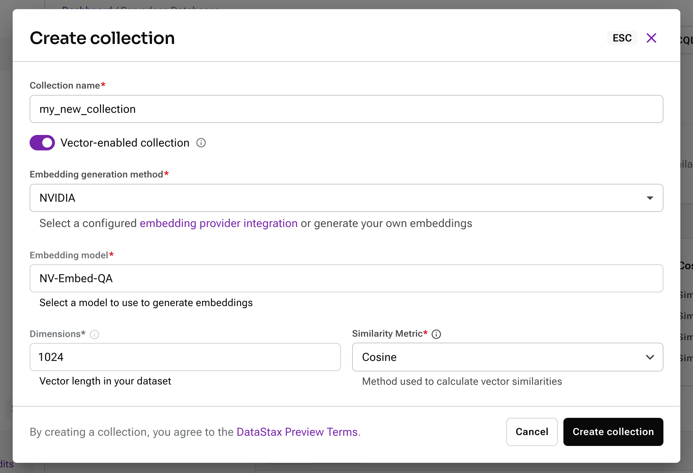

When you’re building a [retrieval-augmented generation (RAG)](https://www.ibm.com/think/topics/retrieval-augmented-generation) app, job number one is preparing your data. You’ll need to take your unstructured data and [split it up into chunks](local link), turn those chunks into [vector embeddings](https://www.ibm.com/think/topics/vector-embedding), and finally, store the embeddings in a [vector database](https://www.ibm.com/think/topics/vector-database).

There are many ways that you can create vector embeddings in JavaScript. In this post, we’ll investigate four ways to generate vector embeddings in Node.js: locally, via API, via a framework, and with Astra DB's Vectorize.

<div class="info">
  <p>This post was originally written for DataStax, but didn't survive a content migration as part of <a href="https://www.ibm.com/new/announcements/ibm-to-acquire-datastax-helping-clients-bring-the-power-of-unstructured-data-to-enterprise-ai-applications">IBM's purchase</a>. I thought the content was useful, so have republished it here.</p>
</div>

## Local vector embeddings

There are lots of open-source models available on [HuggingFace](https://huggingface.co/) that can be used to create vector embeddings. [Transformers.js](https://huggingface.co/docs/transformers.js/en/index) is a module that lets you use machine learning models in JavaScript, both in the browser and Node.js. It uses the [ONNX runtime](https://onnxruntime.ai/) to achieve this; it works with models that have published ONNX weights, of which there are plenty. Some of those models we can use to create vector embeddings.

You can install the module with:

```shell
npm install @huggingface/transformers
```

[The package can actually perform many tasks](https://huggingface.co/docs/transformers.js/index#tasks), but [feature extraction](https://huggingface.co/docs/transformers.js/api/pipelines#module_pipelines.FeatureExtractionPipeline) is what you want for generating vector embeddings.

A popular, local model for vector embedding is [all-MiniLM-L6-v2](https://huggingface.co/Xenova/all-MiniLM-L6-v2). It’s trained as a good all-rounder and produces a 384-dimension vector from a chunk of text.

To use it, import the `pipeline` function from Transformers.js and create an extractor that will perform "feature-extraction" using your provided model. You can then pass a chunk of text to the extractor and it will return a tensor object which you can turn into a plain JavaScript array of numbers.

All in all, it looks like this:

```js
import { pipeline } from "@huggingface/transformers";

const extractor = await pipeline(
  "feature-extraction",
  "Xenova/all-MiniLM-L6-v2"
);

const response = await extractor(
  [
    "A robot may not injure a human being or, through inaction, allow a human being to come to harm.",
  ],
  { pooling: "mean", normalize: true }
);

console.log(Array.from(response.data));
// => [-0.004044221248477697,  0.026746056973934174,   0.0071970801800489426, ... ]
```

You can actually embed multiple texts at a time if you pass an array to the extractor. Then you can call `tolist` on the response and that will return you a list of arrays as your vectors.

```js
const response = await extractor(
  [
    "A robot may not injure a human being or, through inaction, allow a human being to come to harm.",
    "A robot must obey the orders given it by human beings except where such orders would conflict with the First Law.",
    "A robot must protect its own existence as long as such protection does not conflict with the First or Second Law.",
  ],
  { pooling: "mean", normalize: true }
);

console.log(response.tolist());
// [
//   [ -0.006129210349172354,  0.016346964985132217,   0.009711502119898796, ...],
//   [-0.053930871188640594,  -0.002175076398998499,   0.032391052693128586, ...],
//   [-0.05358131229877472,  0.021030642092227936, 0.0010665050940588117, ...]
// ]
```

There are [many models you can use to create vector embeddings from text](https://huggingface.co/models?pipeline_tag=feature-extraction&library=transformers.js), and, because you’re running locally, you can try them out to see which works best for your data. You should pay attention to the length of text that these models can handle. For example, the all-MiniLM-L6-v2 model does not provide good results for more than 128 [tokens](https://help.openai.com/en/articles/4936856-what-are-tokens-and-how-to-count-them) and can handle a maximum of 256 tokens, so it’s useful for sentences or small paragraphs. If you have a bigger source of text data than that, you’ll need to [split your data into appropriately sized chunks](/blog/2024/09/18/how-to-chunk-text-in-javascript-for-rag-applications/).

Local embedding models like this are useful if you’re experimenting on your own machine, or have the [right hardware to run them efficiently when deployed](https://onnxruntime.ai/docs/get-started/with-javascript/node.html). It's an easy way to get comfortable with different models and get a feel for how things work without having to sign up to a bunch of different API services.

Having said that, there are a lot of useful vector embedding models available as an API, so let's take a look at them next.

## APIs

There are an abundance of services that provide embedding models as APIs. These include LLM providers, like [OpenAI](https://platform.openai.com/docs/guides/embeddings), [Google](https://ai.google.dev/gemini-api/docs/embeddings) or [Cohere](https://docs.cohere.com/docs/cohere-embed), as well as specialist providers like [Voyage AI](https://www.voyageai.com/) or [Jina](https://jina.ai/embeddings/). Most providers have general purpose embedding models, but some provide models trained for specific datasets, like [Voyage AI's finance, law and code optimised models](https://docs.voyageai.com/docs/embeddings).

These API providers provide HTTP APIs, often with an npm package to make it easy to call them. You’ll typically need an API key from the service and you can then generate embeddings by sending your text to the API.

For example, you can [use Google's text embedding models through the Gemini API](https://ai.google.dev/gemini-api/docs/embeddings) like this:

```js
import { GoogleGenAI } from "@google/genai";

const ai = new GoogleGenAI({ apiKey: process.env.API_KEY });
const text =
  "A robot may not injure a human being or, through inaction, allow a human being to come to harm.";

const response = await ai.models.embedContent({
  model: "gemini-embedding-001",
  contents: text,
});

console.log(response.embeddings[0].values);
// => [ -0.0049246787, 0.031826325, -0.0075687882, ... ]
```

Each API is different though, so while making a request to create embeddings is normally fairly straightforward, you’ll likely have to learn a new method for each API you want to call—unless of course, you try one of the available frameworks that are intended to simplify this.

## Frameworks

There are many projects out there, like [LangChain](https://js.langchain.com/docs/introduction/) or [LlamaIndex](https://ts.llamaindex.ai/), that create abstractions over the various parts of the GenAI toolchain, including embeddings.

Both LangChain and LlamaIndex enable you to generate embeddings via APIs or local models, all with the same interface. For example, here’s how you can [create the same embedding as above using the Gemini API and LangChain](https://js.langchain.com/docs/integrations/text_embedding/google_generativeai/) together:

```js
import { GoogleGenerativeAIEmbeddings } from "@langchain/google-genai";

const embeddings = new GoogleGenerativeAIEmbeddings({
  apiKey: process.env.API_KEY,
  model: "gemini-embedding-001",
});
const text =
  "A robot may not injure a human being or, through inaction, allow a human being to come to harm.";

const embedding = await embeddings.embedQuery(text);
console.log(embedding);
// => [-0.0049246787, 0.031826325, -0.0075687882, ...]
```

To compare, this is what it looks like to use the [OpenAI embeddings model through LangChain](https://js.langchain.com/docs/integrations/text_embedding/openai/):

```js
import { OpenAIEmbeddings } from "@langchain/openai";

const embeddings = new OpenAIEmbeddings({
  apiKey: process.env.API_KEY,
  model: "text-embedding-3-large",
});
const text =
  "A robot may not injure a human being or, through inaction, allow a human being to come to harm.";

const embedding = await embeddings.embedQuery(text);
console.log(embedding);
// => [0.009445431, -0.0073068426, -0.00814802, ...]
```

Aside from changing the name of the import and sometimes the options, the embedding models all have a consistent interface to make it easier to swap them out.

If you’re using LangChain to create your entire pipeline, these embedding interfaces work very well alongside the vector database interfaces. You can provide an embedding model to the database integration and LangChain handles generating the embeddings as you insert documents or perform vector searches. For example, here is how to embed some documents using Google's embeddings and store them in [Astra DB via LangChain](https://js.langchain.com/docs/integrations/vectorstores/astradb/):

```js
import { GoogleGenerativeAIEmbeddings } from "@langchain/google-genai";
import { AstraDBVectorStore } from "@langchain/community/vectorstores/astradb";

const embeddings = new GoogleGenerativeAIEmbeddings({
  apiKey: process.env.API_KEY,
  model: "gemini-embedding-001",
});

const vectorStore = await AstraDBVectorStore.fromDocuments(
  documents, // a list of document objects to put in the store
  embeddings, // the embeddings model
  astraConfig // config to connect to Astra DB
);
```

When you provide the embeddings model to the database object, you can then use it to perform vector searches too.

```js
const results = vectorStore.similaritySearch(
  "Are robots allowed to protect themselves?"
);
```

LlamaIndex allows for similar creation of embedding models and vector stores that use them. Check out [the LlamaIndex documentation on RAG](https://ts.llamaindex.ai/docs/llamaindex/tutorials/rag).

As a bonus, the lists of models that [LangChain](https://js.langchain.com/docs/integrations/text_embedding/) and [LlamaIndex](https://ts.llamaindex.ai/docs/llamaindex/modules/embeddings) integrate are good examples of popular embedding models.

## Directly in the database

So far, the methods above mostly involve creating a vector embedding independently of storing the embedding in a vector database. When you want to store those vectors in a vector database like Astra DB, it looks a bit like this:

```js
import { DataAPIClient } from "@datastax/astra-db-ts";
const client = new DataAPIClient(process.env.ASTRA_DB_APPLICATION_TOKEN);
const db = client.db(process.env.ASTRA_DB_API_ENDPOINT);
const collection = db.collection(process.env.ASTRA_DB_COLLECTION);

await collection.insertOne({
  text: "A robot may not injure a human being or, through inaction, allow a human being to come to harm.",
  $vector: [0.04574034, 0.038084425, -0.00916391, ...]
});
```

This assumes you have already created a vector enabled collection with the correct number of dimensions for the model you are using.

You can also search against the documents in your collection using a vector like this:

```js
const cursor = collection.find({}, {
  sort: { $vector: [0.04574034, 0.038084425, -0.00916391, ...] },
  limit: 5,
});
const results = await cursor.toArray();
```

In this case, you have to create your vectors first, and then store or search against the database with them. Even in the case of the frameworks, that process happens, but it’s just abstracted away.

With Astra DB, you can have the database generate the embeddings for you as you’re inserting documents into a collection or as you perform a vector search against a collection.

This is called [Astra DB vectorize](https://docs.datastax.com/en/astra-db-serverless/databases/embedding-generation.html); here's how it works.

First, set up an embedding provider integration. There is a built-in integration offering the [NVIDIA NV-Embed-QA model](https://build.nvidia.com/nvidia/embed-qa-4), or you can choose one of the other providers and configure them with your own API key.

Then when you set up a collection, you can choose which embedding provider you want to use and set the correct number of dimensions.



Now, when you add a document to this collection, you can add the content using the special key `$vectorize` and a vector embedding will be created.

```js
await collection.insertOne({
  $vectorize:
    "A robot may not injure a human being or, through inaction, allow a human being to come to harm.",
});
```

When you want to perform a vector search against this collection, you can sort by the special `$vectorize` field and again, Astra DB will handle creating vector embeddings and then performing the search.

```js
const cursor = collection.find(
  {},
  {
    sort: { $vectorize: "Are robots allowed to protect themselve?" },
    limit: 5,
  }
);
const results = await cursor.toArray();
```

This has several advantages:

- It's robust, as Astra DB handles the interaction with the embedding provider
- It can be quicker than making two separate API calls to create embeddings and then store them
- It's less code for you to write

## Choose the method that works best for your application

There are many models, providers, and methods you can use to turn text into vector embeddings. Creating vector embeddings from your content is a vital part of the RAG pipeline and it does require some experimentation to get it right for your data.

You have the choice to host your own models, call on APIs, use a framework, or let Astra DB handle creating vector embeddings for you. And, if you want to avoid code altogether, you could choose to use [Langflow's drag-and-drop interface to create your RAG pipeline](https://docs.langflow.org/chat-with-rag).
