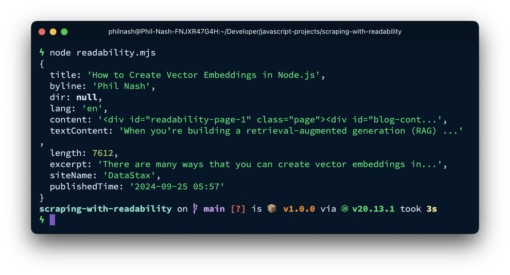

Scraping web pages is one way to fetch content for your [retrieval-augmented generation (RAG)](https://www.ibm.com/think/topics/retrieval-augmented-generation) application. But parsing the content from a web page can be a pain.

Mozilla's open-source library [Readability.js](https://github.com/mozilla/readability) is a useful tool for extracting just the important parts of a web page. Let's look at how to use it as part of a data ingestion pipeline for a RAG application.

## Retrieving unstructured data from a web page

Web pages are a source of unstructured data that we can use in RAG-based apps. But web pages are often full of content that is irrelevant; things like headers, sidebars, and footers. They contain useful context for someone browsing the site, but detract from the main subject of a page.

To get the best data for RAG, we need to remove irrelevant content. When you’re working within one site, you can use tools like [cheerio](https://cheerio.js.org/) to parse the HTML yourself based on your knowledge of the site's structure. But if you're scraping pages across different layouts and designs, you need a good way to return just the relevant content and avoid the rest.

## Repurposing reader view

Most web browsers come with a reader view that strips out everything but the article title and content. Here is the difference between the browser and reader mode when applied to a blog post on my personal site.


Mozilla makes the underlying library for Firefox's reader mode available as a standalone open-source module: [Readability.js](https://github.com/mozilla/readability). So we can use Readability.js in a data pipeline to strip irrelevant content and return high quality results from scraping a web page.

## How to scrape data with Node.js and Readability.js

Let's take a look at an example of scraping the article content from my previous blog post on [creating vector embeddings in Node.js](/blog/2024/09/25/how-to-create-vector-embeddings-in-node-js/). Here's some JavaScript you can use to retrieve the HTML for the page:

```js
const html = await fetch(
  "https://philna.sh/blog/2024/09/25/how-to-create-vector-embeddings-in-node-js/"
).then((res) => res.text());
console.log(html);
```

This includes all the HTML tags as well as the navigation, footer, share links, calls to action and other things you can find on most web sites.

To improve on this, you could install a module like [cheerio](https://cheerio.js.org/) and select only the important parts:

```sh
npm install cheerio
```

```js
import * as cheerio from "cheerio";

const html = await fetch(
  "https://philna.sh/blog/2024/09/25/how-to-create-vector-embeddings-in-node-js/"
).then((res) => res.text());

const $ = cheerio.load(html);

console.log($("h1").text(), "\n");
console.log($("section#blog-content > div:first-child").text());
```

With this code you get the title and text of the article. As I said earlier, this is great if you know the structure of the HTML, but that won't always be the case.

Instead, install [Readability.js](https://github.com/mozilla/readability) and [jsdom](https://github.com/jsdom/jsdom):

```sh
npm install @mozilla/readability jsdom
```

Readability.js normally runs in a browser environment and uses the live document rather than a string of HTML, so we need to include jsdom to provide that in Node.js. Now we can turn the HTML we already loaded into a document and pass it to Readability.js to parse out the content.

```js
import { Readability } from "@mozilla/readability";
import { JSDOM } from "jsdom";

const url =
  "https://philna.sh/blog/2024/09/25/how-to-create-vector-embeddings-in-node-js/";
const html = await fetch(url).then((res) => res.text());

const doc = new JSDOM(html, { url });
const reader = new Readability(doc.window.document);
const article = reader.parse();

console.log(article);
```

When you inspect the article, you can see that it has parsed a number of things from the HTML.



There's the title, author, excerpt, publish time, and both the content and textContent. The textContent property is the plain text content of the article, ready for you to [split into chunks](/blog/2024/09/18/how-to-chunk-text-in-javascript-for-rag-applications/), [create vector embeddings](/blog/2024/09/25/how-to-create-vector-embeddings-in-node-js/), and ingest into a vector database. The content property is the original HTML, including links and images. This could be useful if you want to extract links or process the images somehow.

You might also want to see whether the document is likely to return good results. Reader view works well on articles, but is less useful for other types of content. You can do a quick check to see if the HTML is suitable for processing with Readability.js with the function `isProbablyReaderable`. If this function returns `false` you may want to parse the HTML in a different way, or even inspect the contents at that URL to see whether it has useful content for you.

```js
const doc = new JSDOM(html, { url });
const reader = new Readability(doc.window.document);

if (isProbablyReaderable(doc.window.document)) {
  const article = reader.parse();
  console.log(article);
} else {
  // do something else
}
```

If the page fails this check, you might want to flag the URL to see whether it does include useful information for your RAG application, or whether it should be excluded.

## Using Readability with LangChain.js

If you're using [LangChain.js](https://docs.langchain.com/oss/javascript/langchain/overview) for your application, you can also use Readability.js to return the content from an HTML page. It fits nicely into your data ingestion pipelines, working with other LangChain components, like [text chunkers](/blog/2024/09/18/how-to-chunk-text-in-javascript-for-rag-applications/) and vector stores.

The following example uses LangChain.js to load the same page as above, return the relevant content from the page using the [`MozillaReadabilityTransformer`](https://docs.langchain.com/oss/javascript/integrations/document_transformers/mozilla_readability), split the text into chunks using the [`RecursiveCharacterTextSplitter`](https://docs.langchain.com/oss/javascript/integrations/splitters/recursive_text_splitter), create vector embeddings with OpenAI, and store the data in Astra DB.

You'll need to install the following dependencies:

```shell
npm install @langchain/core @langchain/community @langchain/openai @datastax/astra-db-ts @mozilla/readability jsdom
```

To run the example, you will need to create an Astra DB database and store the database's endpoint and application token in your environment as `ASTRA_DB_APPLICATION_TOKEN` and `ASTRA_DB_API_ENDPOINT`. You will also need an OpenAI API key stored in your environment as `OPENAI_API_KEY`.

Import the dependencies:

```js
import { HTMLWebBaseLoader } from "@langchain/community/document_loaders/web/html";
import { MozillaReadabilityTransformer } from "@langchain/community/document_transformers/mozilla_readability";
import { RecursiveCharacterTextSplitter } from "@langchain/textsplitters";
import { OpenAIEmbeddings } from "@langchain/openai";
import { AstraDBVectorStore } from "@langchain/community/vectorstores/astradb";
```

We use the `HTMLWebBaseLoader` to load the raw HTML from the URL we provide. The HTML is then passed through the `MozillaReadabilityTransformer` to extract the text, which is then split into chunks by the `RecursiveCharacterTextSplitter`. Finally, we create an embedding provider and an Astra DB vector store that will be used to turn the text chunks into vector embeddings and store them in the vector database.

```js
const loader = new HTMLWebBaseLoader(
  "https://philna.sh/blog/2024/09/25/how-to-create-vector-embeddings-in-node-js/"
);
const transformer = new MozillaReadabilityTransformer();
const splitter = new RecursiveCharacterTextSplitter({
  maxCharacterCount: 1000,
  chunkOverlap: 200,
});
const embeddings = new OpenAIEmbeddings({
  model: "text-embedding-3-small",
});
const vectorStore = new AstraDBVectorStore(embeddings, {
  token: process.env.ASTRA_DB_APPLICATION_TOKEN,
  endpoint: process.env.ASTRA_DB_API_ENDPOINT,
  collection: "content",
  collectionOptions: {
    vector: {
      dimension: 1536,
      metric: "cosine",
    },
  },
});
await vectorStore.initialize();
```

The initialisation of all the components makes up most of the work. Once everything is set up, you can load, transform, split, embed and store the documents like this:

```js
const docs = await loader.load();
const sequence = transformer.pipe(splitter);
const vectorizedDocs = await sequence.invoke(docs);
await vectorStore.addDocuments(vectorizedDocs);
```

## More accurate data from web scraping with Readability.js

Readability.js is a battle-tested library powering Firefox's reader mode that we can use to scrape only relevant data from web pages. This cleans up web content and makes it much more useful for RAG.

As we've seen, you can do this directly with the library or using LangChain.js and the `MozillaReadabilityTransformer`.

Getting data from a web page is only the first step in your ingestion pipeline. From here you'll need to split your text into chunks, create vector embeddings, and store everything in a vector database. Then you'll be ready to build your RAG-powered application.
