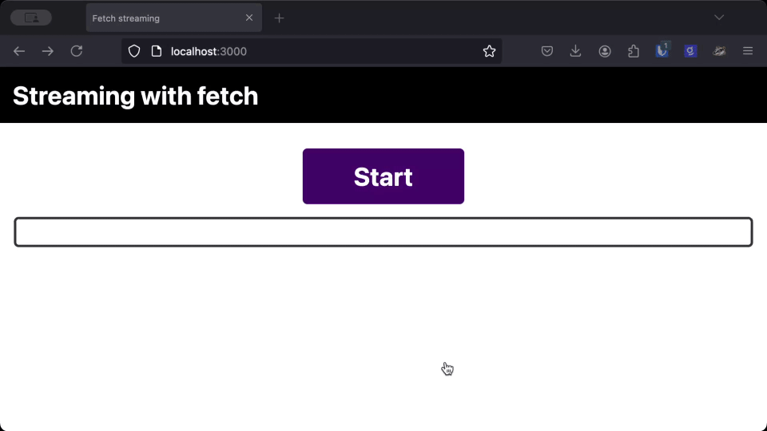
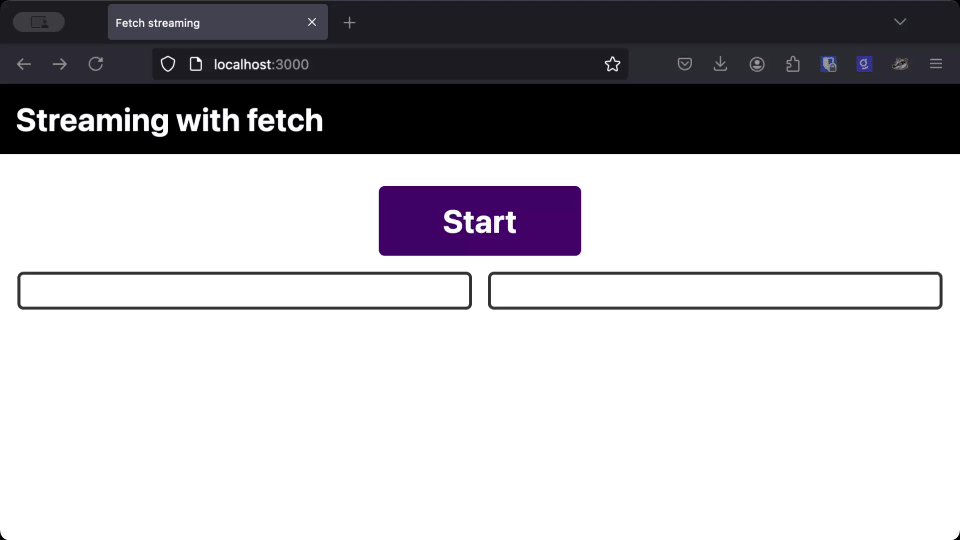

Generative AI enables us to build incredible new types of applications, but large language model (LLM) responses can be slow. If we wait for the full response before updating the user interface, we might be making our users wait more than they need to. Thankfully, most LLM APIs—including OpenAI, Anthropic, and [Langflow](https://langflow.org) provide streaming endpoints that you can use to stream responses as they are generated. In this post, we're going to see how to use [JavaScript's `fetch` API](https://developer.mozilla.org/en-US/docs/Web/API/Fetch_API) to immediately update your front-end application as an LLM generates output and create a better user experience.

## Slow responses without streaming

Let's start with an example to show what a slow result looks like to a user. [You can try it here](https://fetch-streaming.vercel.app/). This [example GitHub repo](https://github.com/philnash/fetch-streaming) demonstrates an Express application that serves up static files and has one endpoint that streams some [lorem ipsum](https://en.wikipedia.org/wiki/Lorem_ipsum) text to the front-end. The following code is how the server streams the response:

```js
app.get("/stream", async (_req, res) => {
  res.set("Content-Type", "text/plain");
  res.set("Transfer-Encoding", "chunked");

  const textChunks = text.replace(/\n/g, "<br>").split(/(?<=\.)/g);

  for (let chunk of textChunks) {
    res.write(chunk);
    await sleep(250);
  }

  res.end();
});
```

The `Content-Type` header shows that we are returning text and the `Transfer-Encoding` header tells the browser that the text will be arriving as a stream of chunks.

Express enables you to write content to the response at any time, using `res.write`. In this case, we break a section of text up into sentences and then write each sentence after a 250 millisecond gap. This is standing in for our streaming LLM response, as it is simpler than putting together an entire GenAI application to demonstrate this.

Let's take a look at how we would normally implement a fetch request to get some data.

```js
const response = await fetch("/stream");
const text = await response.text();
output.innerHTML = text;
```

The text function collects the entire response then decodes it into text. In this example, we write the text to the page. This is fine if the response is fast, but our example server above is returning a new chunk of text every quarter of a second, and it will depend on how long the response is as to how long it takes to resolve `response.text()`.



## Streaming with fetch

Setting up to stream a response from a server is not as straightforward, but the results are worth it. We're going to use the fact that the body of a response is a [`ReadableStream`](https://developer.mozilla.org/en-US/docs/Web/API/ReadableStream). We can then set up a streaming pipeline that decodes the incoming stream and writes it to the page.

We need to decode the stream because the chunks of stream we receive are bytes in the form of a `Uint8Array`. We want them as text, so we can use a [`TextDecoderStream`](https://developer.mozilla.org/en-US/docs/Web/API/TextDecoderStream) to decode the bytes as they flow through. The `TextDecoderStream` is an implementation of a [`TransformStream`](https://developer.mozilla.org/en-US/docs/Web/API/TransformStream); it has both a readable and writable stream, so it can be used in streaming pipelines.

We then want to write the text to the page, so we can build a custom [`WritableStream`](https://developer.mozilla.org/en-US/docs/Web/API/WritableStream) to handle that. Let's see the code:

```js
const response = await fetch("/stream");
const decoderStream = new TextDecoderStream("utf-8");
const writer = new WritableStream({
  write(chunk) {
    output.innerHTML += chunk;
  },
});

response.body.pipeThrough(decoderStream).pipeTo(writer);
```

And now let's compare this version side-by-side to the version that waits for the whole response before it decodes and writes it to the page.



As you can see, the text takes the same amount of time to load whether we use the streaming version or the regular version, but **users can start reading the response much earlier** when it streams straight to the page.

When you are dealing with LLMs, or other responses that progressively generate a response, streaming the response and rendering it to the page as you receive it gives users a much better perceived performance over waiting for the full response.

## More to know about streams

There's more to streams than the code above. Our basic implementation of a `WritableStream` above included a `write` function that is called when new chunks of data are ready to be written. You can also define the following functions:

- `start`: called as soon as the stream is constructed and used to set up any resources needed for writing the data
- `close`: called once there are no more chunks to write to the stream and used to release any resources
- `abort`: called if the application signals that the stream should be immediately closed and, like `close`, used to clean up any resources. Unlike `close`, `abort` will run even if there are chunks still to be written and cause them to be thrown away.

You can also pass a `queuingStrategy` to a `WritableStream` that allows you to control how fast the stream receives data. This is known as ["backpressure," and you can read more about it on MDN](https://developer.mozilla.org/en-US/docs/Web/API/Streams_API/Concepts#backpressure).

### Catching errors

If there is an error in the stream, like a break in the connection between the front-end and the server, you will need to catch the error. The stream method `pipeTo` is the final method that is called in a pipeline and returns a `Promise`. You can either catch errors with the `catch` method on the `Promise`:

```js
response.body
  .pipeThrough(decoderStream)
  .pipeTo(writer)
  .catch((error) => {
    console.log("Something went wrong with the stream!");
  });
```

Or you can await the result and use a `try/catch` block:

```js
try {
  await response.body
    .pipeThrough(decoderStream)
    .pipeTo(writer);
} catch((error) => {
  console.log("Something went wrong with the stream!");
}
```

### Server-sent events

In the example above, the stream from the server was just text. Many LLM APIs, including [Anthropic](https://docs.anthropic.com/en/api/messages-streaming), [Google](https://ai.google.dev/gemini-api/docs/get-started/tutorial?lang=rest#stream_generate_content), [OpenAI](https://platform.openai.com/docs/api-reference/streaming), and [Langflow](https://langflow.org), send more data back than just the text response and use the [server-sent events standard](https://developer.mozilla.org/en-US/docs/Web/API/Server-sent_events/Using_server-sent_events) to format those streams.

To send data as server-sent events we'd need to change a couple of things from our original server. The `Content-Type` becomes `text/event-stream`. Instead of sending plain text, each message must be labeled as either "event," "data," "id," or "retry," and messages are separated by two newlines. Taking the server side example from earlier, we could update it like so:

```js
app.get("/stream", async (_req, res) => {
  res.set("Content-Type", "text/event-stream");
  res.set("Transfer-Encoding", "chunked");

  const textChunks = text.replace(/\n/g, "<br>").split(/(?<=\.)/g);

  for (let chunk of textChunks) {
    res.write(`event: message\ndata: ${chunk}\n\n`);
    await sleep(250);
  }

  res.end();
});
```

Now each message is of the form:

```
event: message
data: ${textChunk}
```

Which means we need to parse this on the client side. Normally, this is easily done by making a connection to the server using the [`EventSource`](https://developer.mozilla.org/en-US/docs/Web/API/EventSource) object and letting the browser parse the messages into events. If you are building with GenAI, you're most likely sending user queries to the server over a POST request, which is not supported by `EventSource`.

To use server-sent events with a POST request, you’ll need to parse the responses. One way to do this is to use the [eventsource-parser module](https://www.npmjs.com/package/eventsource-parser), which even makes a transform stream available; this fits in nicely with our existing application.

To handle server-sent events in our existing front-end, we can import an `EventSourceParserStream` from `eventsource-parser/stream` and use it in our pipeline.

```js
const response = await fetch("/stream");
const decoderStream = new TextDecoderStream("utf-8");
const parserStream = new EventSourceParserStream();
const writer = new WritableStream({
  write(event) {
    output.innerHTML += event.data;
  },
});

response.body
  .pipeThrough(decoderStream)
  .pipeThrough(parserStream)
  .pipeTo(writer);
```

Note that now we get an event emitted from the stream that has a data property containing the data sent from the server. This is still text in this application, but you could send, for example, a JSON object containing structured data instead. You can see [this implementation of server-sent event streaming in the example GitHub repo](https://github.com/philnash/fetch-streaming?tab=readme-ov-file#server-sent-events).

### Async iterables

There is an easier way to handle the incoming chunks of a streaming response using a `for await...of` loop.

In this case we don't need to create our own `WritableStream`, though we do still need to use a `TextDecoder` to decode the bytes into a string. It relies on the body of the `response` being a `ReadableStream` that implements the async iterable protocol, and looks like this:

```js
const decoder = new TextDecoder();
for await (const chunk of response.body) {
  const text = decoder.decode(chunk, { stream: true });
  streamOutput.innerHTML += text;
}
```

Sadly, [Safari does not support this technique](https://caniuse.com/mdn-api_response_body_readable_byte_stream), so we have to avoid it in the front-end for now.

## Get comfortable with streaming

Understanding how to stream a response from a web server and consume it on the client is vital to creating a great user experience when working with LLMs. Using `fetch` as a `ReadableStream` is the web-native way to do so. When you stream a potentially slow text response, you can improve the perceived performance of your application, leading to happier users and customers

If you're playing with [Langflow](https://langflow.org), you'll find that you can stream responses from the API, and you should take advantage of this.

[Vercel's AI SDK uses fetch to make streaming easier for a number of frameworks with the useChat hook](https://sdk.vercel.ai/docs/reference/ai-sdk-ui/use-chat). For React Server Component users, you can also stream UI using [Vercel's AI RSC API](https://sdk.vercel.ai/docs/ai-sdk-rsc/streaming-values).

If you want to play around with streaming, you can check out [the example code from this blog post on GitHub](https://github.com/philnash/fetch-streaming).
