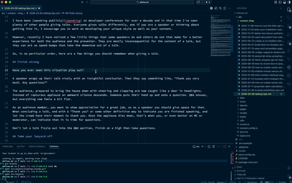

I have been [speaking publicly](/speaking) at developer conferences for over a decade and in that time I've seen plenty of other people giving talks. Everyone gives talks differently, and if you are a speaker or thinking about getting into it, I encourage you to work on developing your unique style as well as your content.

However, recently I have noticed a few little things that some speakers do and others do not that make for a better experience for both the audience and the presenter. They are mostly inconsequential for the content of a talk, but they can act as speed bumps that take the momentum out of a talk.

So, in no particular order, here are a few things you should remember when giving a talk.

## Finish strong

Have you ever seen this situation play out?

A speaker wraps up their talk nicely with an insightful conclusion. Then they say something like, "Thank you very much. Any questions?"

The audience, prepared to bring the house down with cheering and clapping are now caught like a deer in headlights. Instead of rapturous applause an awkward silence descends. Someone puts their hand up and asks a question. Q&A ensues, but everything now feels a bit flat.

As an audience member, you want to show appreciation for a great job, so as a speaker you should give space for that. When concluding a talk, end with a "Thank you" or some other definitive way to indicate you are finished speaking, and let the crowd have their moment to thank you. Once the applause dies down, that's when you, or even better an MC or moderator, can indicate that it is time (or not) for questions.

Don't let a talk fizzle out into the Q&A portion, finish on a high. Deal with the questions afterwards.

## Take your lanyard off

The conference lanyard is the sign that you are part of this temporary tribe that has formed. When wearing it, you can speak to anyone else also adorned in the conference colours knowing you have some common ground.

When you are on stage to deliver a talk, you no longer need the lanyard to signify you are part of the experience. But that's not why you should take it off. You should remove it for the duration of your talk simply because it gets in the way.

On stage there is more to consider. A lanyard hanging around your neck may get in the way of your laptop if you need to use it, it might bother the microphone cable, it might just not look that great. You probably didn't choose your outfit based on the conference colour scheme, so why throw a dangling colour clash into the mix?

Take your lanyard off for the talk, but don't forget to put it back on afterwards. You will want to help people remember who you are once you're no longer in the spotlight.

## Keyboard shortcuts you wish you'd known for years

There are two macOS keyboard shortcuts that I think are vital to know if you want to make smooth transitions between parts of your talk.

### Cmd + F1

Let's say you're presenting in Keynote and you're using the presenter view; you can see the notes on your laptop, the audience sees the slides on the screen. Your laptop is using the external screen as an extended display. Now you want to demo something. To do this you need to switch to mirroring, so that you can see the same demo on your laptop as the audience is seeing on the screen.

You could make this switch by opening the display settings and changing the setting. However, the keyboard shortcut is `Cmd + F1`. Flipping between mirroring and extending with a keypress is quicker, smoother and keeps the energy in your presentation. `Cmd + F1`, commit it to memory.

### Cmd + Shift + F

If you're using Chrome and you want to go into fullscreen (with the green button in the top left of the window, or `Shift + Fn + F`) and you find that the address bar is still showing, taking up valuable screen real estate, that can be fixed. `Cmd + Shift + F` toggles whether the address bar shows. You're probably reading this in Chrome right now, try it out!

## Resize the font, don't zoom the window

If you plan to live code or just show code within an IDE as part of a demo, you should make sure that the font is readable by the audience. I recommend doing this as part of a tech check before you are supposed to go on stage. This gives you the time to check things yourself and resize the text correctly.

You might think that zooming in, with the shortcut `Cmd and +` will help the audience see the code. In VS Code and other similar editors, that zooms the text and the entire interface. By the time the text is of a size that the audience will be able to read it, it will be crowded out by the file explorer and the terminal.

Instead, take the time to open the settings (`Cmd + ,`) and change the font size to something readable. That way the rest of the interface stays out of the way. If you plan to show things in the built-in terminal, make sure to increase the terminal font size too, it's a different setting.

Walk to the back of the room, or get a friend to check and give you a thumbs up, and make sure things are readable before you start the talk.

## Trust in the tech

If you are in the fortunate position to be speaking at an event with a crew looking after you on stage, they will likely give you a microphone before you go on and be in control of it. Most of the time this means that the microphone is on and you needn't touch it, but it is muted at the sound desk. Then, when it is time for you to start they will unmute you and everyone will hear you.

It can be unnerving to believe that once you start speaking everyone will be able to hear you, but you should. Much like my first tip to finish strong, you also want to start strong, and "Hello, can you hear me? Is this on?" is not the way to achieve that.

Instead start by introducing yourself, start with a joke, start by thanking the audience for showing up. However you want to start, assume you will be heard and confidently start speaking. If something does go wrong, it's not your fault (unless you turned your microphone off on purpose). When things go right, you will capture the audience's attention and kick your session off in style.

## Small tips, big impact

I have, of course, done the opposite of all of these things myself. I've started by asking if I can be heard, zoomed my editor until only the side panel was visible, fiddled in settings and menus to make my screen show the right thing, flapped my lanyard around on stage, and finished with "Thank you, any questions?" and a silent room. I only hope by sharing some of these tips that you can avoid all of those things yourself, sail through your talk with all your energy being used to wow the audience, and feel great at the end of it all.

So remember your shortcuts, take that lanyard off, trust that you will be heard, get your font sizes right, start with confidence and finish strong. I can't wait to see what you are going to talk about.
